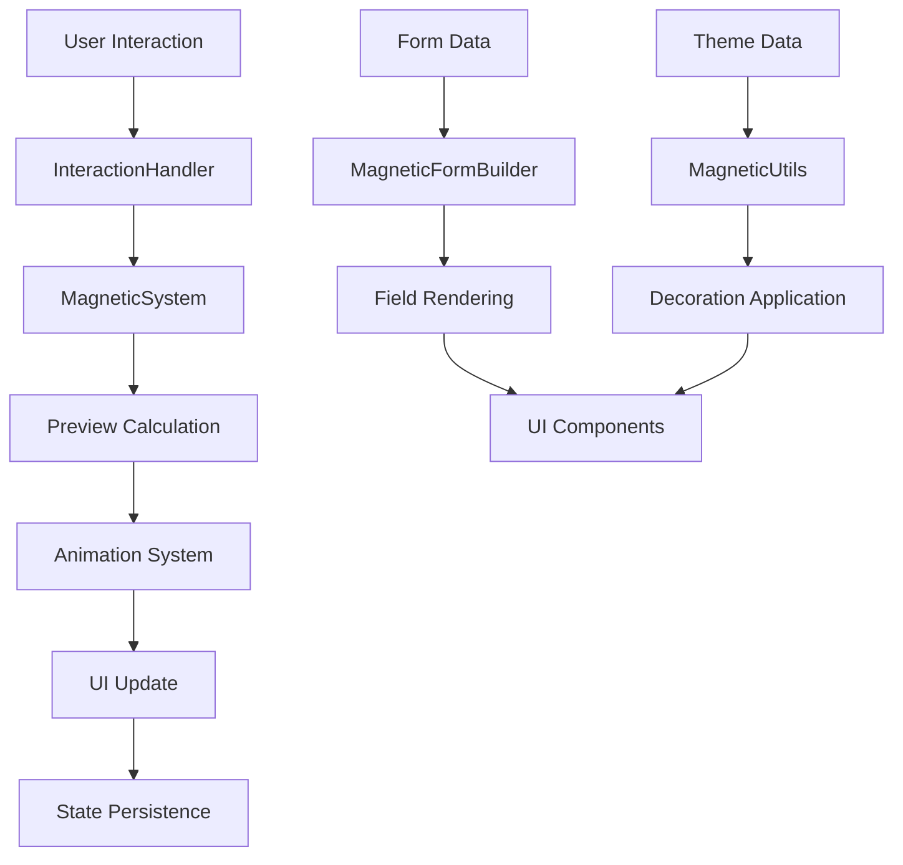

# Design Document

## Overview

This design document outlines the architecture and implementation strategy for consolidating the Magnetic Form Builder codebase from 5,325 lines to approximately 3,200 lines while maintaining 100% functionality preservation. The consolidation will be achieved through strategic file merging, code deduplication, and structural optimization.

## Architecture

### Current Architecture Analysis

```
lib/
├── magnetic_form_builder.dart (133 lines) - Main export
├── src/
    ├── components/
    │   ├── field_builders.dart (174 lines) - Test field creation
    │   └── form_ui_builder.dart (396 lines) - UI component builders
    ├── constants/
    │   ├── animation_constants.dart (86 lines) - Animation timing
    │   ├── field_constants.dart (129 lines) - Field dimensions
    │   └── grid_constants.dart (36 lines) - Grid configuration
    ├── handlers/
    │   ├── auto_expand_handler.dart (342 lines) - Auto-expand logic
    │   ├── drag_handler.dart (191 lines) - Drag operations
    │   └── resize_handler.dart (343 lines) - Resize operations
    ├── models/
    │   ├── field_config.dart (192 lines) - Field configuration
    │   ├── form_field.dart (175 lines) - Form field model
    │   └── magnetic_card_system.dart (295 lines) - Grid system
    ├── storage/
    │   └── form_storage_repository.dart (43 lines) - Data persistence
    ├── systems/
    │   ├── field_animations.dart (215 lines) - Animation system
    │   ├── field_preview_system.dart (774 lines) - Preview logic
    │   └── grid_utils.dart (287 lines) - Grid utilities
    ├── theme/
    │   ├── field_theme_extension.dart (49 lines) - Theme extensions
    │   └── magnetic_theme.dart (223 lines) - Theme definitions
    ├── utils/
    │   ├── decoration_utils.dart (250 lines) - UI decorations
    │   └── logger.dart (81 lines) - Debug logging
    └── widgets/
        └── magnetic_form_builder.dart (911 lines) - Main widget
```

### Target Architecture

```
lib/
├── magnetic_form_builder.dart (133 lines) - Main export [UNCHANGED]
├── src/
    ├── components/
    │   ├── field_builders.dart (174 lines) - Test field creation [UNCHANGED]
    │   └── form_ui_builder.dart (350 lines) - UI builders [OPTIMIZED]
    ├── constants/
    │   └── magnetic_constants.dart (120 lines) - All constants [CONSOLIDATED]
    ├── handlers/
    │   └── interaction_handler.dart (500 lines) - All interactions [CONSOLIDATED]
    ├── models/
    │   ├── field_models.dart (300 lines) - Field-related models [CONSOLIDATED]
    │   └── magnetic_card_system.dart (250 lines) - Grid system [OPTIMIZED]
    ├── storage/
    │   └── form_storage_repository.dart (43 lines) - Data persistence [UNCHANGED]
    ├── systems/
    │   └── magnetic_system.dart (950 lines) - Core logic [CONSOLIDATED]
    ├── theme/
    │   ├── field_theme_extension.dart (49 lines) - Theme extensions [UNCHANGED]
    │   └── magnetic_theme.dart (200 lines) - Theme definitions [OPTIMIZED]
    ├── utils/
    │   └── magnetic_utils.dart (200 lines) - All utilities [CONSOLIDATED]
    └── widgets/
        └── magnetic_form_builder.dart (700 lines) - Main widget [OPTIMIZED]
```

## Components and Interfaces

### 1. MagneticConstants (Consolidated Constants)

**Purpose**: Single source of truth for all configuration values, timing, and dimensions.

**Design**:
```dart
class MagneticConstants {
  // Animation constants (from AnimationConstants)
  static const Duration previewDuration = Duration(milliseconds: 150);
  static const Duration commitDuration = Duration(milliseconds: 300);
  static const Duration revertDuration = Duration(milliseconds: 200);
  static const Curve previewCurve = Curves.easeOutQuart;
  
  // Field constants (from FieldConstants)
  static const double containerPadding = 16.0;
  static const double fieldGap = 8.0;
  static const double cardHeight = 70.0;
  
  // Grid constants (from GridConstants)
  static const int maxColumns = 6;
  static const int maxRows = 20;
  static const double minFieldWidth = 0.16; // 1/6 of container
}
```

**Consolidation Strategy**:
- Merge all three constant files into logical groups
- Remove duplicate documentation
- Organize constants by functional area
- Maintain all existing values exactly

### 2. InteractionHandler (Consolidated Handlers)

**Purpose**: Unified handler for all user interactions including drag, resize, and auto-expand operations.

**Design**:
```dart
class InteractionHandler {
  // Drag operations (from DragHandler)
  static void handleLongPressStart(String fieldId, LongPressStartDetails details, /* context */) {
    // Consolidated drag start logic
  }
  
  static void handleLongPressMove(String fieldId, LongPressMoveUpdateDetails details, /* context */) {
    // Consolidated drag move logic
  }
  
  static void handleLongPressEnd(String fieldId, LongPressEndDetails details, /* context */) {
    // Consolidated drag end logic
  }
  
  // Resize operations (from ResizeHandler)
  static void handleResizeStart(String fieldId, ResizeDirection direction, /* context */) {
    // Consolidated resize start logic
  }
  
  static void handleResizeUpdate(String fieldId, DragUpdateDetails details, ResizeDirection direction, /* context */) {
    // Consolidated resize update logic
  }
  
  static void handleResizeEnd(String fieldId, ResizeDirection direction, /* context */) {
    // Consolidated resize end logic
  }
  
  // Auto-expand operations (from AutoExpandHandler)
  static Map<String, FieldConfig> calculateAutoExpand(String fieldId, Map<String, FieldConfig> configs, /* context */) {
    // Consolidated auto-expand logic
  }
  
  // Shared utilities
  static bool _isValidPosition(Offset position, Size containerSize) { /* shared validation */ }
  static void _animateToPosition(/* shared animation logic */) { /* shared animation */ }
  static Rect _calculateFieldBounds(FieldConfig config, Size containerSize) { /* shared calculation */ }
}
```

**Consolidation Strategy**:
- Merge all handler classes into logical method groups
- Extract common validation and animation logic
- Maintain identical public interfaces
- Preserve all interaction behaviors

### 3. MagneticSystem (Consolidated Systems)

**Purpose**: Core system logic for preview calculations, grid operations, and animations.

**Design**:
```dart
class MagneticSystem {
  // Preview system (from FieldPreviewSystem)
  static Map<String, FieldConfig> calculatePreviewPositions({
    required int targetRow,
    required String draggedFieldId,
    required Map<String, FieldConfig> currentConfigs,
    required double containerWidth,
  }) {
    // Consolidated preview calculation logic
  }
  
  static PreviewInfo getPreviewInfo({
    required int targetRow,
    required String draggedFieldId,
    required Map<String, FieldConfig> currentConfigs,
    required double containerWidth,
  }) {
    // Consolidated preview info logic
  }
  
  // Grid utilities (from GridUtils)
  static bool checkFieldOverlap(FieldConfig field1, FieldConfig field2, double containerWidth) {
    // Consolidated overlap detection
  }
  
  static double calculateRowAvailableSpace(int row, Map<String, FieldConfig> configs, {String? excludeFieldId}) {
    // Consolidated space calculation
  }
  
  static List<FieldConfig> getFieldsInRow(int row, Map<String, FieldConfig> configs) {
    // Consolidated row field retrieval
  }
  
  // Animation system (from FieldAnimations)
  static void animateMultipleFields({
    required TickerProvider vsync,
    required Map<String, FieldConfig> fromConfigs,
    required Map<String, FieldConfig> toConfigs,
    required Function(Map<String, FieldConfig>) onUpdate,
    VoidCallback? onComplete,
    Duration? duration,
    Curve? curve,
  }) {
    // Consolidated animation logic
  }
  
  // Shared calculations
  static Offset _normalizePosition(Offset position, Size containerSize) { /* shared normalization */ }
  static double _calculateOptimalWidth(double availableSpace, double currentWidth) { /* shared optimization */ }
  static int _getRowFromPosition(double y) { /* shared row calculation */ }
  static int _getColumnFromPosition(double x, double containerWidth) { /* shared column calculation */ }
}
```

**Consolidation Strategy**:
- Merge preview, grid, and animation systems
- Extract shared mathematical calculations
- Maintain all existing algorithms exactly
- Optimize method organization for readability

### 4. FieldModels (Consolidated Models)

**Purpose**: Unified model definitions for form fields and configurations.

**Design**:
```dart
// Enums and supporting types
enum ResizeDirection { left, right }

// Main model classes
class MagneticFormField {
  // Existing implementation preserved exactly
}

class FieldConfig {
  // Existing implementation preserved exactly
  // Add shared utility methods from MagneticCardSystem
  
  // Consolidated utility methods
  static int getRowFromPosition(double y) { /* from MagneticCardSystem */ }
  static int getColumnFromPosition(double x, double containerWidth) { /* from MagneticCardSystem */ }
  static double getColumnPositionNormalized(int column) { /* from MagneticCardSystem */ }
  static int getColumnsFromWidth(double width) { /* from MagneticCardSystem */ }
}

// Preview state classes
class PreviewInfo {
  // Existing implementation preserved exactly
}

class PreviewState {
  // Existing implementation preserved exactly
}
```

**Consolidation Strategy**:
- Keep MagneticFormField and FieldConfig as separate classes
- Move utility methods from MagneticCardSystem to FieldConfig
- Maintain all existing model interfaces
- Preserve all data structures exactly

### 5. MagneticUtils (Consolidated Utilities)

**Purpose**: Unified utility functions for decorations, logging, and helper operations.

**Design**:
```dart
class MagneticUtils {
  // Decoration utilities (from DecorationUtils)
  static BoxDecoration createFieldDecoration({
    required BuildContext context,
    required FieldDecorationState state,
  }) {
    // Consolidated decoration logic
  }
  
  static BoxDecoration createSnapGuideDecoration(BuildContext context) {
    // Consolidated snap guide decoration
  }
  
  // Logging utilities (from Logger) - Production optimized
  static void debug(String message) {
    // Conditional compilation for debug builds only
    assert(() {
      developer.log('🐛 $message', name: 'DEBUG');
      return true;
    }());
  }
  
  static void info(String message) {
    // Conditional compilation for debug builds only
    assert(() {
      developer.log('ℹ️ $message', name: 'INFO');
      return true;
    }());
  }
  
  // Error logging always enabled
  static void error(String message) {
    developer.log('❌ $message', name: 'ERROR');
  }
  
  // Shared utility methods
  static Color _adjustColorOpacity(Color color, double opacity) { /* shared color utility */ }
  static BorderRadius _getStandardBorderRadius() { /* shared border utility */ }
}
```

**Consolidation Strategy**:
- Merge decoration and logging utilities
- Optimize logging for production builds
- Extract common decoration patterns
- Maintain all existing decoration behaviors

### 6. Optimized Main Widget

**Purpose**: Streamlined main widget with reduced complexity while maintaining all functionality.

**Design Optimizations**:
- Consolidate similar state management patterns
- Extract complex methods to private helpers
- Optimize widget rebuilding logic
- Maintain identical public API

**Key Areas for Optimization**:
```dart
class _MagneticFormBuilderState extends State<MagneticFormBuilder> with TickerProviderStateMixin {
  // Consolidated state variables
  final Map<String, FieldConfig> _fieldConfigs = {};
  final Map<String, dynamic> _formData = {};
  PreviewState _previewState = PreviewState.initial();
  
  // Optimized build method
  @override
  Widget build(BuildContext context) {
    return _buildWithTheme(context);
  }
  
  // Consolidated interaction handlers
  void _handleFieldInteraction(String fieldId, InteractionType type, dynamic details) {
    // Unified interaction handling
  }
  
  // Consolidated preview management
  void _updatePreview(String fieldId, int targetRow) {
    // Unified preview updates
  }
  
  // Consolidated animation management
  void _animateFields(Map<String, FieldConfig> fromConfigs, Map<String, FieldConfig> toConfigs) {
    // Unified field animations
  }
}
```

## Data Models

### Preserved Data Structures

All existing data models will be preserved exactly:

1. **MagneticFormField**: No changes to structure or interface
2. **FieldConfig**: No changes to structure, additional utility methods
3. **PreviewInfo**: No changes to structure or interface
4. **PreviewState**: No changes to structure or interface

### Internal Data Flow



## Error Handling

### Preserved Error Handling

All existing error handling patterns will be maintained:

1. **Validation Errors**: Identical validation logic and error messages
2. **Configuration Errors**: Same error detection and reporting
3. **Runtime Errors**: Identical error recovery mechanisms
4. **Type Safety**: All existing null safety and type checking preserved

### Consolidated Error Utilities

```dart
class ErrorHandling {
  static void validateFieldConfig(FieldConfig config) {
    // Consolidated validation logic
  }
  
  static void handleInteractionError(String operation, Exception error) {
    // Consolidated error handling
  }
  
  static void logPerformanceWarning(String operation, Duration duration) {
    // Consolidated performance monitoring
  }
}
```

## Testing Strategy

### Test Preservation Requirements

1. **Unit Tests**: All existing unit tests must pass without modification
2. **Widget Tests**: All widget tests must produce identical results
3. **Integration Tests**: All integration tests must demonstrate identical behavior

### Consolidation Testing Approach

```dart
// Test structure for consolidated classes
class InteractionHandlerTest {
  testGroup('Drag Operations', () {
    // Test all drag functionality from original DragHandler tests
  });
  
  testGroup('Resize Operations', () {
    // Test all resize functionality from original ResizeHandler tests
  });
  
  testGroup('Auto-Expand Operations', () {
    // Test all auto-expand functionality from original AutoExpandHandler tests
  });
  
  testGroup('Shared Utilities', () {
    // Test new shared utility methods
  });
}
```

### Performance Testing

```dart
class PerformanceTest {
  void testDragPerformance() {
    // Validate 60fps during drag operations
    // Compare with original performance benchmarks
  }
  
  void testMemoryUsage() {
    // Validate memory usage patterns
    // Ensure no memory leaks in consolidated code
  }
  
  void testStartupTime() {
    // Validate initialization performance
    // Compare with original startup benchmarks
  }
}
```

## Implementation Phases

### Phase 1: Constants Consolidation
- Merge all constant files
- Update all references
- Validate no behavioral changes

### Phase 2: Utilities Consolidation
- Merge decoration and logging utilities
- Optimize for production builds
- Validate all UI rendering

### Phase 3: Handler Consolidation
- Merge all interaction handlers
- Extract shared logic
- Validate all user interactions

### Phase 4: System Consolidation
- Merge preview, grid, and animation systems
- Optimize shared calculations
- Validate all core functionality

### Phase 5: Model Optimization
- Consolidate related model classes
- Move utility methods appropriately
- Validate all data structures

### Phase 6: Main Widget Optimization
- Streamline main widget implementation
- Optimize state management
- Validate complete functionality

### Phase 7: Final Integration and Testing
- Complete integration testing
- Performance validation
- Documentation updates

## Quality Assurance

### Validation Criteria

1. **Functional Testing**: Every feature must work identically
2. **Performance Testing**: Performance must meet or exceed original
3. **API Testing**: All public APIs must remain unchanged
4. **Integration Testing**: All integration points must work identically
5. **Regression Testing**: No existing functionality can be broken

### Success Metrics

1. **Line Count**: Target 3,200 lines (40% reduction from 5,325)
2. **Test Coverage**: 100% of existing tests must pass
3. **Performance**: Maintain or improve all performance benchmarks
4. **API Compatibility**: Zero breaking changes to public API
5. **Functionality**: 100% feature preservation

This design ensures that the consolidation achieves the target line reduction while maintaining absolute fidelity to the original functionality, performance, and API compatibility.